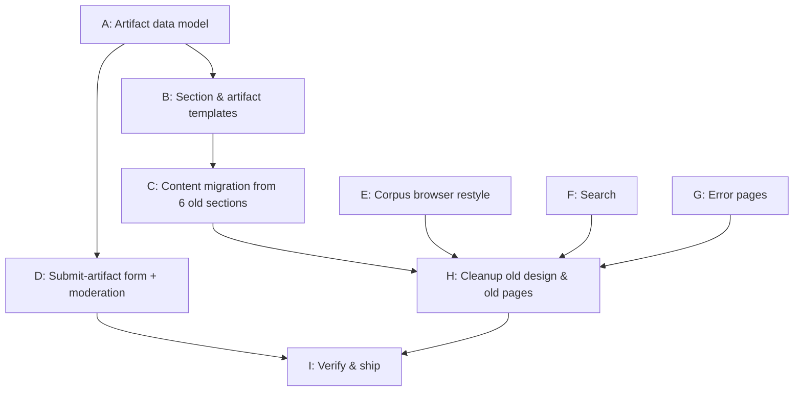

# Plan v2: lang.org.ua — New Design + Structured Artifact Catalog

> **STATUS (2026-07-05): ALL PHASES A–I IMPLEMENTED AND VERIFIED** on the local
> dev DB (35+ URLs, both locales, forms POSTed end-to-end, corpus chain with live
> MongoDB, search, 404/500). Not yet committed. Production rollout checklist
> lives in `migration.todo`. Key deviations from plan:
> - barba.js transitions turned out to be disabled in the shipped bundle
>   (`initTransition()` commented out) — no `data-barba-prevent` needed anywhere.
> - The design bundle already contained everything the 2021 brief asked for
>   (`services-list` accordion for product pages, `add-product-form`, `.copy-block`
>   with clipboard JS, `.table`, `.pagination`, `search-result__block`, `error_404.svg`)
>   — extracted the component contracts from main.css + webpack sources.
> - The bundled `add-product` form JS hijacks `<form class="add-product-form">`
>   submissions (static-mockup leftover) — the class lives on a wrapper div instead.
> - Section listing uses the designed accordion (`services-list`), not cards;
>   the cards/list view toggle (`services-types`) is wired and functional.
> - Legacy `home.ProductPage` model kept until production DB is converted.

## Vision (revised after scope correction)

lang.org.ua is a catalog of Ukrainian NLP artifacts. The old site organizes them as six
rich-text sections (from the old `base.html` nav): **corpora, dictionaries, gazetteers,
services, libraries, models**. The upgrade is not just a re-skin: every section migrates to
the new design **and onto a new structured data model**, and a public **submit form** lets
the community propose new artifacts of any type (corpora, datasets, models, libraries, …).

This matches the original 2021 design brief (`~/Downloads/Бріф на lang.org.ua.md`, may be
partially outdated), which called for: (1) products moved from CMS pages into DB models;
(2) a community submission form with internal moderation; (3) a **feedback form collecting
how/where the products are used**; (4) product-type pages as **card grids with name,
description, optional authorship/license, download links, and pagination**; (5) static-page
typography incl. **code blocks (monospace + copy) and tables**; (6) optionally a search
page with snippet-style results. Verified: `main.css`/`bachoo_main.js` already ship the
components for all of this (`.card--text`, `.pagination`, `.code`, `.copy-block` with
working clipboard JS, `.table`) — the design side is delivered; the wiring is not.

## Current state (verified)

- **New design (Bachoo) done:** home, about us, manifesto, contact us (+thank-you), static pages.
- **Products section is hollow:** `ProductsPage` → `ProductPage` (`home/models.py:632`) is a
  bare `AbstractPage`; `product_page.html` just dumps `translated_body`. No artifact fields.
- **Design breadcrumbs already point at the target:** commented-out "Нові надходження"
  badge in `home_page.html:113`; dead buttons `href="#"` (Залишити відгук) and
  `href="add-product.html"` (Доповнити продукт) at `home_page.html:127`. The pug comments
  (`products-section.pug` etc.) show a Bachoo static-HTML design bundle exists — obtain it;
  it likely contains the add-product page, product/section page, and possibly 404 designs.
- **Still old design:** corpus browsing app (4 templates, MongoDB-backed), search
  (also unwired + wrong template engine), 404/500.
- **Contact form** saves `ContactUsMessage` to DB only — no email (SendGrid TODO).

## Phase map

A is the foundation; E/F/G are independent and parallelizable.

---

## Phase A — Artifact data model (foundation) [DONE 2026-07-05]
depends_on: none

> Implemented as the `catalog` app. Seven types seeded by migration. Legacy sections
> converted in the local dev DB via `manage.py convert_product_pages --type-map
> korpusi=corpora slovniki=dictionaries gazetiri=gazetteers servisi=services
> biblioteki=libraries modeli=models` (same command + map to run on production).
> Placeholder templates render; Phase B replaces them.

New `catalog` Django app (keeps `home` lean); models follow the existing
`TranslatedField` UA/EN pattern:

1. **`ArtifactType`** — Wagtail snippet: name UA/EN, slug, SVG icon, sort order.
   Types are *data*, not code: corpora, datasets, models, libraries, services,
   dictionaries, gazetteers today; new types without migrations tomorrow.
2. **`ArtifactPage(AbstractPage)`** — one page per artifact:
   - FK to `ArtifactType`; tags (`taggit`, already a Wagtail dep)
   - short description UA/EN (cards) + full body UA/EN (detail page)
   - repeatable external links (InlinePanel or StreamField): GitHub, Hugging Face,
     paper, demo, direct download — each with kind + URL + label
   - license, authors/credits, size/stats free text
   - `last_significant_update` date → drives the "Нові надходження" badge
     (closes the "has updates" TODO) 
   - thumbnail (Wagtail image) → rendered via the new thumbnail macro (closes that TODO)
   - `search_fields` so Wagtail search covers the catalog
3. **`SectionPage(AbstractPage)`** — replaces `ProductPage` as the section container:
   tied to an `ArtifactType`, `subpage_types = [ArtifactPage]`, lists live children as
   cards with sort-by-updated and the new-arrivals badge.
4. Data migration path: existing `ProductPage` rows (the six sections) get migrated to
   `SectionPage` (same treebeard nodes, new content type) or new pages created alongside
   and slugs swapped — decide during implementation; **slugs must stay stable**
   (`corpora/`, `dictionaries/`, …) so old URLs keep resolving; add wagtail-redirects
   entries for anything that moves.

## Phase B — Section & artifact templates (new design)
depends_on: A

1. `section_page.html` — card grid per the brief: `.card--text` cards with name, short
   description, optional authorship/license, download link(s); **pagination**
   (`.pagination` styles exist in `main.css`); badge; breadcrumbs.
2. `artifact_page.html` — title, type/tags, links block (buttons per link kind),
   license/authors meta, rich-text body, thumbnail.
3. **Code & table blocks for editors** (brief task 1): extend the rich-text setup
   (`home/wagtail_hooks.py`) or add StreamField blocks so artifact bodies and static
   pages can embed code blocks rendered as `.copy-block`/`.code` (clipboard JS already
   in `bachoo_main.js`) and tables rendered as `.table`.
4. Homepage products section: iterate `SectionPage`s; un-comment and wire the
   red-star badge (any child artifact updated in the last N days).
5. Thumbnail macro in shared jinja2 (`common/` or `_macro.html`) using Wagtail
   `image()` renditions.
6. If the Bachoo design bundle (pug/HTML export) is available, match its markup for
   these pages; otherwise compose from existing components.

## Phase C — Content migration
depends_on: B

1. Inventory pass: pull the six sections' rich text from the live DB; parse artifact
   entries (name, description, links) into a CSV/JSON worklist.
2. Management command `import_artifacts` — creates `ArtifactPage` drafts from the
   worklist under the right section (both locales where text exists).
3. Manual curation in Wagtail admin: fill type, license, links-by-kind, EN texts;
   publish section by section.
4. Old rich-text section bodies retired only after their artifacts are live (Phase H).

## Phase D — Public forms: submit an artifact + usage feedback
depends_on: A (types must exist)

1. **`SubmitArtifactPage`** — Wagtail page with custom `serve()` (same pattern as
   `ContactUsPage`, `home/models.py:669`): fields — artifact type (dropdown from
   `ArtifactType`), name, description, links, license, submitter name/email;
   reCAPTCHA (already wired for contact form — reuse).
2. **`ArtifactSubmission`** model — moderation inbox in admin (same pattern as
   `ContactUsMessage`), plus an admin action "create draft ArtifactPage from submission".
3. **Usage-feedback form** (brief goal 3 — "how and where are the products used"):
   `FeedbackPage` + `UsageFeedback` model — which artifact(s) (chooser over
   `ArtifactPage`), how/where used, organization, contact; same inbox + notification
   pattern. This, not the contact page, is where "Залишити відгук" points.
4. **Email notifications via SendGrid** (closes that TODO) for artifact submissions,
   usage feedback, and the existing contact form: `django-anymail[sendgrid]`,
   `SENDGRID_API_KEY` env var in `settings/production.py`, recipients on
   `GenericSiteSettings`; try/except + logging so a mail failure never breaks a form.
5. Wire homepage buttons: "Доповнити продукт" → submit page; "Залишити відгук" → feedback page.

## Phase E — Corpus browser (ubertext) restyle
depends_on: none (parallel)

Unchanged from plan v1 — this is a live-data browsing UI on MongoDB, distinct from the
catalog (catalog artifacts link *to* it):

1. Base prep: `_includes/head.html` gets a `page_title` context fallback (corpus views
   pass no Wagtail `page`); per-page CSS via `extra_js` block or a new overridable block
   in `bachoo_base.html` itself (blocks inside the head include can't be overridden).
2. Port `corpus_home`, `corpus_source`, `corpus_sample` onto `bachoo_base.html`; the
   stats tables should use the design's `.table` styles (already in `main.css` — additive
   `corpus.css` only if something is missing); self-host Chartist (drop CDN), recolor chart.
3. `corpus_details` → new minimal `bachoo_bare_base.html` (new head/fonts, no
   header/footer/barba) to keep the distraction-free reading view.
4. `data-barba-prevent` on corpus links so inline chart/table JS survives navigation.

## Phase F — Search
depends_on: A (to index artifacts), E step 1 (head fallback)

1. Move `search/templates/search/search.html` (Django-templates file extending a Jinja2
   base — broken by construction) → `search/jinja2/search/search.html`, rewritten on
   `bachoo_base.html`; new-design form + snippet-style results (brief task 4) + pagination.
2. Re-enable `path('search/', …)` in `i18n_patterns` (`languk/languk/urls.py:27`);
   add a search entry point to the header/menu.
3. Ensure `ArtifactPage.search_fields` make catalog content searchable.

## Phase G — Error pages
depends_on: none (parallel)

- `404.html` on the new design (extending `bachoo_base.html` is safe).
- `500.html` standalone and self-contained: inline CSS, zero CMS/menu/DB queries.

## Phase H — Cleanup
depends_on: C, E, F, G

1. Delete `base.html`, `bare_base.html` + old assets (`lang-uk.css`, `custom.css`,
   `lang-uk-ie.css`, `js/main.js`, `js/contents-list.js`, `static/images/converted/`);
   grep before each delete.
2. Retire `ProductPage` model/template once the six sections run on `SectionPage`.
3. Remove dead `newborn` app (import at `urls.py:12`) and obsolete commented routes.
4. Update `migration.todo`.

## Phase I — Verify & ship
depends_on: D, H

1. Full click-through both locales: home → each section → artifact pages → submit form
   (end-to-end incl. email) → contact form → corpus (4 levels + chart) → search → 404/500.
2. Old-URL spot checks (`/corpora/`, `/dictionaries/`, …) — no broken slugs.
3. `manage.py check --deploy`, `collectstatic`; commit per phase; merge
   `new_version` → `master`.

## Decisions (confirmed by Dmytro, 2026-07-05)

1. **Artifact model shape:** Wagtail *pages* — `ArtifactPage` under `SectionPage`,
   per-artifact URLs, translated routing, Wagtail search integration.
2. **Moderation flow:** submission inbox (`ArtifactSubmission` + SendGrid notification)
   with an admin action converting accepted submissions into draft `ArtifactPage`s.
3. **Launch types (7):** corpora, dictionaries, gazetteers, services, libraries, models,
   **datasets**. Types live in the `ArtifactType` snippet — more can be added in admin
   (the brief also mentions "вектори"/embeddings — can live under models or become its
   own type later without code changes).

## Risks / Open questions

1. **Design bundle** — the pug-comment trail says a Bachoo static export exists
   (incl. `add-product.html`). If Dmytro can share it, Phases B/D/G match it; otherwise
   compose from existing components.
2. `bachoo_main.js` is a 446 KB prebuilt bundle, no sources in repo — avoid touching it;
   barba interplay handled with `data-barba-prevent`.
3. Content migration needs live-DB access (and MongoDB for corpus testing).
